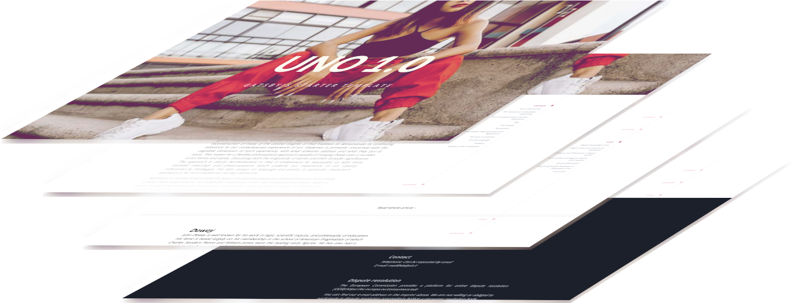

<div align="center">
  <h1>UNO - Minimal Gatsby Starter Template</h1>
  <sup>GatsbyJS · Tailwind CSS · SASS/SCSS</sup>
</div>

<br><br>



<br><br>

Kick off your project with this text centered boilerplate.
This starter ships with the main Gatsby configuration files, Tailwind CSS and routable modals.


## Quick start

1.  **Create a Gatsby site.**

    Use the Gatsby CLI to create a new site, specifying the uno starter.

    ```shell
     # create a new Gatsby site using the default starter
    gatsby new gatsby-starter-uno https://github.com/nextlevelshit/gatsby-starter-uno
    ```

1.  **Start developing.**

    Navigate into your new site’s directory and start it up.

    ```shell
    cd gatsby-starter-uno/
     gatsby develop
    ```

1.  **Open the source code and start editing!**

    Your site is now running at `http://localhost:8000`!

    _Note: You'll also see a second link: _`http://localhost:8000/___graphql`_. This is a tool you can use to experiment with querying your data. Learn more about using this tool in the [Gatsby tutorial](https://www.gatsbyjs.org/tutorial/part-five/#introducing-graphiql)._

    Open the `gatsby-starter-uno` directory in your code editor of choice and edit `src/pages/index.js`. Save your changes and the browser will update in real time!

## What's inside?

A quick look at the top-level files and directories you'll see in a Gatsby project.

    .
    ├── docs
    ├── node_modules
    ├── pages
    └── src
        ├── components
        ├── images
        ├── pages
        ├── styles
        └── templates
    ├── .gitignore
    ├── gatsby-browser.js
    ├── gatsby-config.js
    ├── gatsby-node.js
    ├── gatsby-ssr.js
    ├── LICENSE
    ├── package.json
    ├── README.md
    ├── tailwind.config.js
    └── yarn.lock

1.  **`/docs`**: This directory contains all of the modules of code that your project depends on (npm packages) are automatically installed.

2.  **`/node_modules`**: This directory contains all of the modules of code that your project depends on (npm packages) are automatically installed.

3.  **`/pages`**: This directory contains all markdown files which all get a static path to navigate to. For now they are used for the content of routable modals.

4.  **`/src`**: This directory will contain all the code related to what you will see on the front-end of your site (what you see in the browser) such as your site header or a page template. `src` is a convention for „source code”.

    4.1. **`/src/components`**: This directory contains reuasable components that you can implement on purpose. They run as stand-alone and do not have any dependencies to other modules, components or pages. Some are organized in directories, if your include some styling.
 
    4.2. **`/src/images`**: This direcotry contains (for now) all the images used for the `image-map` plugin that creates an interactive first impression of your website.
 
    4.3. **`/src/styles`**: This directory contains the main part of your styles, defines CSS variables and imports the tailwind functionality. All global stylings that are not connected to a specific component (see above) come here.
 
    4.4. **`/src/templates`**: This directory contains templates which are helpful to generate routable pages inside of `gatsby-node.js`.

5.  **`.gitignore`**: This file tells git which files it should not track / not maintain a version history for.

6.  **`gatsby-browser.js`**: This file is where Gatsby expects to find any usage of the [Gatsby browser APIs](https://www.gatsbyjs.org/docs/browser-apis/) (if any). These allow customization/extension of default Gatsby settings affecting the browser.

7.  **`gatsby-config.js`**: This is the main configuration file for a Gatsby site. This is where you can specify information about your site (metadata) like the site title and description, which Gatsby plugins you’d like to include, etc. (Check out the [config docs](https://www.gatsbyjs.org/docs/gatsby-config/) for more detail).

8.  **`gatsby-node.js`**: This file is where Gatsby expects to find any usage of the [Gatsby Node APIs](https://www.gatsbyjs.org/docs/node-apis/) (if any). These allow customization/extension of default Gatsby settings affecting pieces of the site build process.

9.  **`gatsby-ssr.js`**: This file is where Gatsby expects to find any usage of the [Gatsby server-side rendering APIs](https://www.gatsbyjs.org/docs/ssr-apis/) (if any). These allow customization of default Gatsby settings affecting server-side rendering.

9.  **`LICENSE`**: Uno starter is licensed under Apache 2.0.

10. **`package.json`**: A manifest file for Node.js projects, which includes things like metadata (the project’s name, author, etc). This manifest is how npm knows which packages to install for your project.

11. **`README.md`**: A text file containing useful reference information about your project.

12. **`tailwind.config.js`**: A configuration file for changing the default styling parameters for Tailwind CSS. General styling adaptions should be done inside this file instead of overwriting everything in the SCSS files or component styles.

13. **`yarn.lock`** (See `package.json` below, first). This is an automatically generated file based on the exact versions of your npm dependencies that were installed for your project. **(You won’t change this file directly).**

